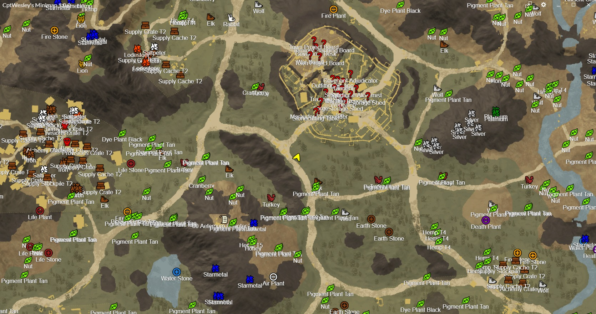
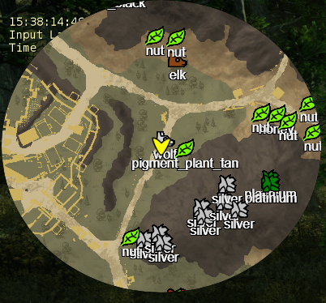
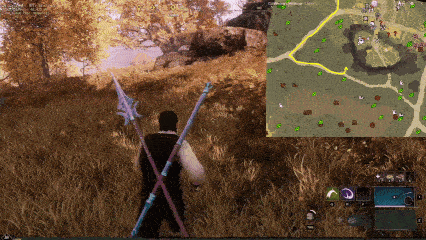
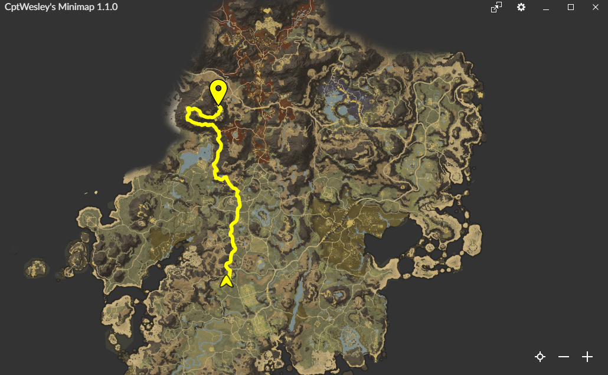

# CptWesley's Minimap

<a href="https://discord.gg/dCgStTDaet" target="_blank"></a>
<a href="https://www.buymeacoffee.com/cptwesley" target="_blank"></a>

Minimap for [Amazon's New World](https://www.newworld.com/).
The application uses [Overwolf's](https://www.overwolf.com/) approved API for getting character positions.
It then utilizes data obtained from [StudioLoot's New World Interactive Map](https://www.newworld-map.com/) to render all objects of interest around the player.

Get it from the <a href="https://www.overwolf.com/app/Wesley_Baartman-CptWesley_s_Minimap" target="_blank">Overwolf Appstore</a> or see the [installation instructions](https://github.com/CptWesley/NewWorldMinimap#installation-and-usage) below.

Join the [Discord](https://discord.gg/dCgStTDaet)!

Looking for the legacy C# app? You can find it [here](https://github.com/CptWesley/NewWorldMinimap/tree/master/dotnet)!

## Table of Contents
- [Current Features](https://github.com/CptWesley/NewWorldMinimap#current-features)
- [Planned Features](https://github.com/CptWesley/NewWorldMinimap#planned-features)
- [Known Issues](https://github.com/CptWesley/NewWorldMinimap#known-issues)
- [Examples](https://github.com/CptWesley/NewWorldMinimap#examples)
- [Installation and Usage](https://github.com/CptWesley/NewWorldMinimap#installation-and-usage)
- [Development](https://github.com/CptWesley/NewWorldMinimap#development)
- [Licensing](https://github.com/CptWesley/NewWorldMinimap#licensing)
- [Contribution](https://github.com/CptWesley/NewWorldMinimap#contribution)
- [Support Me](https://github.com/CptWesley/NewWorldMinimap#support-me)

## Current Features
- Render surroundings of the player (including resources).
- Track the player (including direction).
- Resizable window (great for full-screen usage on second monitor).
- Allow overlaying.
- Support for multiple monitors.
- Zooming on the map.
- Changing icon sizes.
- Showing icon text (can be turned off).
- Filter on certain resources.
- Configurable transparency.
- Resizeable and moveable overlay.
- Different minimap shapes.
- Saving settings.
- Compass mode (rotate minimap around player instead of other way around).
- Different interpolation and extrapolation modes for smoother movement on map (linear, cosine, none).
- Seperately configureable zoom level for towns.
- View live location of friends.
- GPS that points you to a marker following known roads.
- Localisation
  - English (Complete)
  - Italian (Complete)
  - Spanish (Complete)
  - French (Complete)
  - German (Complete)
  - Polish (Complete game references)
  - Portugese (Complete game references)
  - Danish (Complete menus)
  - Dutch (Complete menus)
  - Romanian (Complete menus)
  - Russian (Complete menus)

## Planned Features
- Private markers.
- Paths along private markers.

## Known Issues
- Compass mode might not show some corners of the map, depending on the size of the window.

## Examples
<br>Second monitor full-screen window.  
<br>In-game semi-transparent (configureable) overlay.  
<br>Different minimap shapes.  
<br>Compass mode.  
<br>Cosine interpolation.  
<br>GPS navigation.  
<br>GPS navigation.  

## Installation and Usage
- Make sure you have installed [Overwolf](https://download.overwolf.com/install/Download).
- You now have 4 options:
  - Get the latest release available on our [Overwolf store page](https://www.overwolf.com/app/Wesley_Baartman-CptWesley_s_Minimap). There releases have been inspected by the Overwolf QA team.  
    <a href="https://www.overwolf.com/app/Wesley_Baartman-CptWesley_s_Minimap" target="_blank"></a>
  - Get the latest release available from the [releases page](https://github.com/CptWesley/NewWorldMinimap/releases). These are the latest releases that might not have yet been inspected by the Overwolf QA team.
  - Get the latest build artifact [here](https://nightly.link/CptWesley/NewWorldMinimap/workflows/overwolf/master/app-artifact.zip). These builds are automatically created and might be very unstable, but will contain the newest features.
    - Download the `app-artifact.zip` at the bottom of the page. This `.zip` will contain the produced `.opk` file.
  - Get any other available build from the [build-artifacts](https://github.com/CptWesley/NewWorldMinimap/actions/workflows/overwolf.yml). These builds are automatically created and might be very unstable, but will contain the newest features. This requires being logged into GitHub to download.
    - Go to the [page](https://github.com/CptWesley/NewWorldMinimap/actions/workflows/overwolf.yml)
    - Click on the build you are interested in (higher is more recent).
    - Download the `app-artifact.zip` at the bottom of the page. This `.zip` will contain the produced `.opk` file.
- Install the application.
- Make sure that Overwolf is enabled for New World:
  - Right click the Overwolf tray icon.
  - Open settings.
  - Navigate to Overlay & Hotkeys.
  - Make sure that the New World switch is enabled.
- Start the game, the minimap should now appear.
- If you want to change the settings, **right click** anywhere on the overlay.
- If you want to open the desktop app to use on your second monitor, click the icon in the top right of the overlay.

## Development

Currently, the Overwolf version of the application is the only supported one. The .NET application is considered legacy. This section will only contain information on how to develop the Overwolf application.

### Building and running

1. Ensure you have [NodeJS](https://nodejs.org) installed. Verify whether you can use npm by running <kbd>npm -v</kbd> in a terminal. If it doesn't print an error, proceed with the next step.
2. Install [Yarn](https://yarnpkg.com/). While npm works as a package manager, Yarn is just better. Run <kbd>npm install -g yarn</kbd> to install it.
3. Open a terminal in the `overwolf` directory of this repository.
4. Run <kbd>yarn install</kbd> to download and install the required dependencies.
5. To build the application, you have two options:
    1. <kbd>yarn watch</kbd> will continuously build the application whenever there is an update. This is the recommended command.
    2. <kbd>yarn build</kbd> will build the application once.
    3. <kbd>yarn build:prod</kbd> will also build the application once, but it will be a production build. This allows for optimizations, such as minification, and a production build of React (which is faster). Source maps are included, and an .opk (Overwolf package) file is also generated.
6. Go to Overwolf Settings - About - Development options to open the Overwolf developer tools.
7. Select _Load unpacked extension..._ and navigate to the `overwolf/dist` directory of this repository. It contains the build output if the build was successful. You may get an error at this step, see below for more information.
8. Enable the Overwolf overlay for New World. Go to Overwolf settings - Overlay & Hotkeys, and enable the switch for New World. The application icon should appear beside the name of the game.
9. Launch the application from the Overwolf dock, or launch the game to see the app in action.

When loading an unpacked extension, you might encounter an error where Overwolf will not allow you to load an unauthorized extension.
When this happens, you need to make two modifications to the file `overwolf\public\manifest.json`.
The fields `meta.name` and `meta.author` should be updated to have the values `"Sample App"` and `"Overwolf"` respectively; using these values allows you to use the unpacked extension.
In short, the manifest should look somewhat like the following:

```json
{
  "manifest_version": 1,
  "type": "WebApp",
  "meta": {
    "name": "Sample App",
    "author": "Overwolf",
```

Rebuild the application after making the required changes to the application manifest.

### Development

Although there are no real requirements for developing the app, a nice editor is Visual Studio Code.
It offers integration with TypeScript, the language used for the extension.
If you decide to use Visual Studio Code, make sure to open the `overwolf` directory in VSCode.
Opening the repository root will work as well, but ESLint probably won't play nice then.

Should you decide to open the `overwolf` directory in VSCode, chances are you'll get a popup with some recommended extensions. These will help find code smells, or make the code adhere to this repository's style configuration.
You can use the built-in terminal to run commands such as `yarn watch` to automatically run webpack in watch mode, continuously building the application when a change is detected.

## Licensing
The source code is fully [MIT licensed](https://github.com/CptWesley/NewWorldMinimap/blob/master/LICENSE).

## Contribution
Any help is welcome. Feel free to open [issues or feature requests](https://github.com/CptWesley/NewWorldMinimap/issues) or create a [pull request](https://github.com/CptWesley/NewWorldMinimap/pulls).

## Support Me
Want to support me in other ways? You can [buy me a coffee](https://www.buymeacoffee.com/cptwesley)! But don't feel obliged to!
